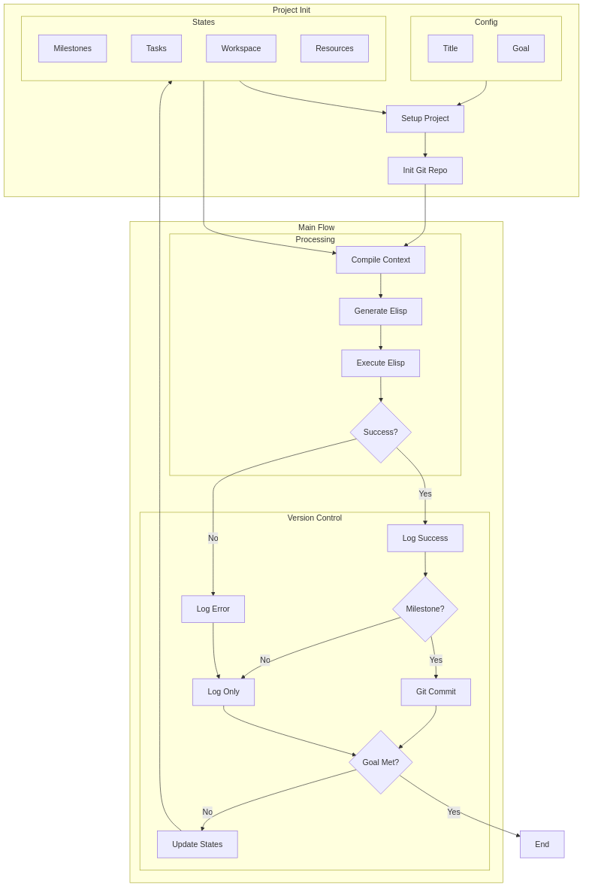
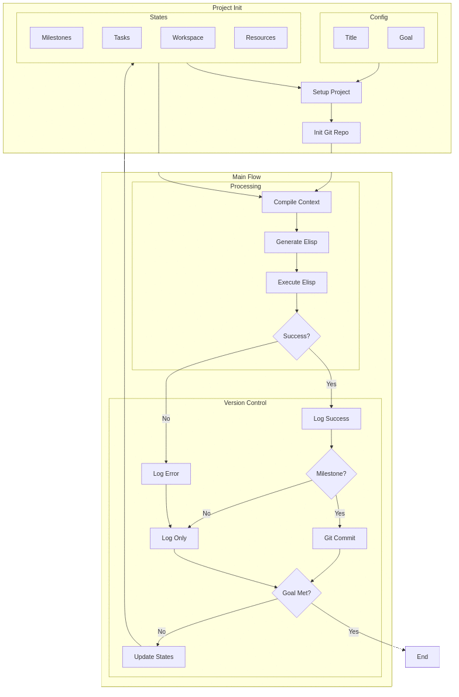

<!-- ---
!-- title: 2024-12-31 02:24:41
!-- author: ywata-note-win
!-- date: /home/ywatanabe/.dotfiles/.emacs.d/lisp/llemacs/README.md
!-- --- -->

# Llemacs — LLM Agents on Emacs

LLEMACS is an file-based LLM agent system written in Elisp

# Architecture



# Disclaimer
- THIS REPOSITORY IS CURRENTLY UNDER ACTIVE DEVELOPMENT
- WE DO NOT HAVE ANY RESPONSIBILITY FOR UNINTENDED FILE CHANGES CREATED BY THIS SYSTEM

## Apptainer

``` bash
./main.sh -m build
./main.sh -m shell
./main.sh -m run
```

## Workspace
[./docs/tree_workspace.txt](./docs/tree_workspace.txt)