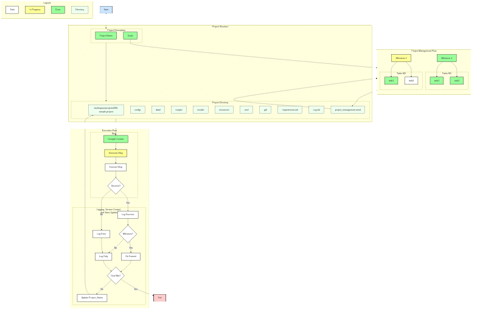

<!-- ---
!-- Timestamp: 2025-01-11 09:54:45
!-- Author: ywatanabe
!-- File: /home/ywatanabe/proj/llemacs/README.md
!-- --- -->
<!-- Time-stamp: "2025-01-11 09:54:45 (ywatanabe)" -->
<!-- File: README.md -->
<!-- ---
!-- title: 2025-01-06 12:14:35
!-- author: ywata-note-win
!-- date: /home/ywatanabe/proj/llemacs/README.md
!-- --- -->

# Llemacs — LLM Agents on Emacs

Llemacs is a file-based LLM agent system implemented in Elisp

## Features
- [x] Multiple LLM provider support (Anthropic/Google/DeepSeek)
- [x] Structured logging with SQLite and file-based systems
- [x] Template-based prompt management
- [x] Mermaid-based project visualization
- [x] Containerized execution via Apptainer
- [ ] Version control integration
- [ ] Capture user corrections
- [ ] Learning Mechanism
  - Store successful patterns
  - PR feedback as metrics

## Disclaimer
- This repository is under active development
- The system is not yet fully functional yet
- Although Apptainer restricts agent access to the [`./workspace`](./workspace) directory, we assume no responsibility for any unintended file modifications.

## Automatic project development

``` elisp
(llemacs-llm-switch-provider "google")

(progn
  ;; Initialize a project: setting project-name and goals
  (llemacs--pj-init 
      "epilepsy-prediction-project" 
      "- Create demo ECoG signals sampled at 400 Hz with 16 channels
       - Create a demo script to classify preictal vs. interictal states using machine learning
       - Evaluate the performances using balanced accuracy, with plotting confusion matrix")
       
  ;; On WSL: Symlink to file:///C:/Users/wyusu/Documents/current-project-win
  (llemacs--path-pj-update-symlink) 

  ;; Single thread version for debugging: (llemacs-run--steps 7)
  (llemacs-run-steps 7)
  
  ;; Monitoring automatic development
  (llemacs-monitor)
)
```

## Installation
[`./docs/installation.md`](./docs/installation.md)

## Architecture
<a href="./docs/project_flow/project_flow.svg">
    
</a>

Generated by mermaid ([source](./docs/project_flow/project_flow.mmd)), which will be helpful for both users and agents.

## Permission control via Apptainer

Apptainer provides permission control by restricting agent access to the workspace directory only.

``` bash
main -m build  # Create sandbox
main -m shell  # Enter sandbox
main -m run    # Launch Emacs as an agent
```

## Contact
- support@llemacs.com
- Yusuke.Watanabe@unimelb.edu.au
