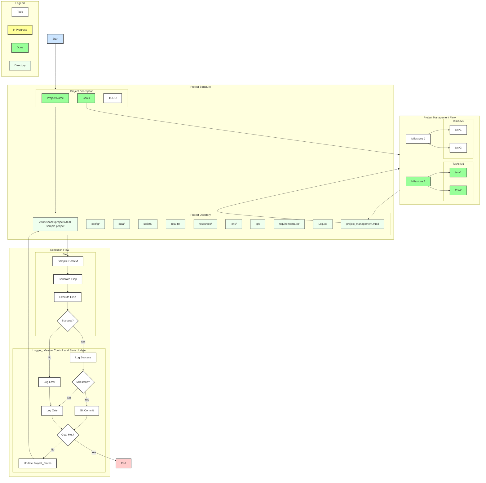

<!-- ---
!-- title: 2025-01-05 05:24:47
!-- author: Yusuke Watanabe
!-- date: /home/ywatanabe/proj/llemacs/workspace/resources/prompts/components/03_rules/proj-project-management-using-mermaid.md
!-- --- -->

# Rule: proj-project-management-using-mermaid
* Understand the hierarchy of project components: goals, milestones, and tasks.
* Breakdown the goals into milestones. Upon achievement of milestone, `git commit` is performed.
* Breakdown milestones into manageable tasks.
* Breakdown complex tasks into small tasks. 
  * Tasks will be performed by agents, including yourself in the future, with feedback loop enabled.
  * Each task must be manageable with ONE ELISP CODE, often connected with the `progn` command. 
  * Thus, split the tasks when interaction is necessary. For example, when `ls <directory>`, a task should be stopped.
* Organize project progress/plans into this mermaid fil for project management: `llemacs--path-pj-pm-mmd` (this file has the `.mmd` extension).
  * In the mermaid file, use state tracking tags (i.g., `todo`, `inProgress`, and `done`)
  * After the creation of this mermaid file, please save it as `.png` and `.svg` files, with changing extensions from `.mmd`
* This is an example of project is like this:

* Use these Elisp code if they are helpful.
``` elisp* 
(defun my/mermaid-compile ()
  "Generate PNG, SVG, and GIF after saving Mermaid files."
  (interactive)
  (when (and (eq major-mode 'mermaid-mode)
             (buffer-file-name))
    (let* ((input-file (buffer-file-name))
           (base-name (file-name-sans-extension input-file)))
      (call-process "mmdc" nil nil nil
                    "-i" input-file
                    "-o" (concat base-name ".png")
                    "--backgroundColor" "transparent")
      (call-process "mmdc" nil nil nil
                    "-i" input-file
                    "-o" (concat base-name ".svg")
                    "--backgroundColor" "transparent"
                    "-f" "svg")
      (call-process "convert" nil nil nil
                    (concat base-name ".png")
                    (concat base-name ".gif"))
      (message "Created %s.png, %s.svg and %s.gif" base-name base-name base-name))))

(defun my/mermaid-after-save-hook ()
  (my/mermaid-compile))

(use-package mermaid-mode
  :ensure t
  :custom
  (setq mermaid-output-format ".png")
  :hook
  (after-save . my/mermaid-after-save-hook))

(use-package ob-mermaid
  :ensure t
  :custom
  (ob-mermaid-cli-path "/usr/local/bin/mmdc")
  (ob-mermaid-extra-args "--backgroundColor transparent -f svg"))

(org-babel-do-load-languages
 'org-babel-load-languages
 '((mermaid . t)))
```